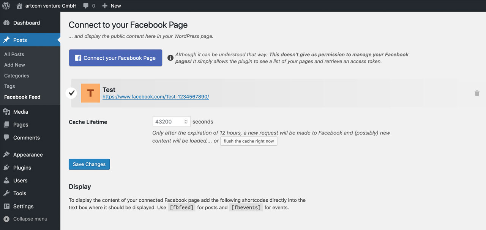

# Facebook Feed to WordPress

Auto-embed your (public) Facebook posts.

| ⚠️ **Required Facebook app is waiting for approval** ⚠️ |
| --- |

## Installation

1. Upload files to the `/wp-content/plugins/` directory of your WordPress installation.
  * Either [download the latest files](https://github.com/artcomventure/wordpress-plugin-facebookFeed/archive/master.zip) and extract zip (optionally rename folder)
  * ... or clone repository:
  ```
  $ cd /PATH/TO/WORDPRESS/wp-content/plugins/
  $ git clone https://github.com/artcomventure/wordpress-plugin-facebookFeed.git
  ```
  If you want a different folder name than `wordpress-plugin-facebookFeed` extend clone command by ` 'FOLDERNAME'` (replace the word `'FOLDERNAME'` by your chosen one):
  ```
  $ git clone https://github.com/artcomventure/wordpress-plugin-facebookFeed.git 'FOLDERNAME'
  ```
2. Activate the plugin through the 'Plugins' screen in WordPress.
3. **Enjoy**

## Usage

Once activated you'll find the 'Facebook Feed' settings page listed in the submenu of 'Posts'.

1. Click on the Facebook Button (will open a popup)
2. Login to your Facebook account
3. Select the page from which you want to display the content on your WordPress Blog



To display posts/events insert the shortcode `[fbfeed]`/`[fbevents]` into the editor.

## Plugin Updates

Although the plugin is not _yet_ listed on https://wordpress.org/plugins/, you can use WordPress' update functionality to keep it in sync with the files from [GitHub](https://github.com/artcomventure/wordpress-plugin-facebookFeed).

**Please use for this our [WordPress Repository Updater](https://github.com/artcomventure/wordpress-plugin-repoUpdater)** with the settings:

* Repository URL: https://github.com/artcomventure/wordpress-plugin-facebookFeed/
* Subfolder (optionally, if you don't want/need the development files in your environment): build

_We test our plugin through its paces, but we advise you to take all safety precautions before the update. Just in case of the unexpected._

## Questions, concerns, needs, suggestions?

Don't hesitate! [Issues](https://github.com/artcomventure/wordpress-plugin-facebookFeed/issues) welcome.